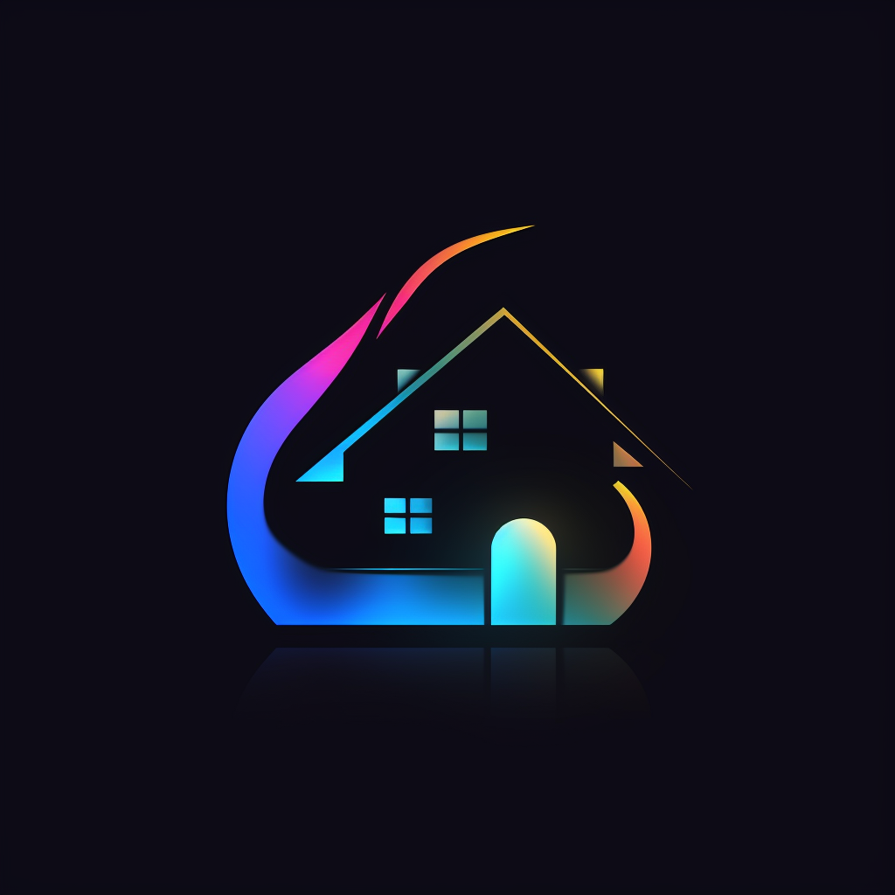

# SmartHomie

SmartEcoHome is a smart home application focused on energy consumption. The app provides real-time monitoring and management of energy use across various smart home devices, offering users insight into their consumption patterns and suggestions for energy savings.

## Features

- **Device Integration**: Seamlessly integrate with a variety of smart devices like lights, thermostats, and more.
- **Real-time Monitoring**: View the energy consumption of each device in real-time.
- **Historical Data**: Analyze past energy usage to detect patterns and trends.
- **Energy Saving Recommendations**: Get personalized suggestions based on your usage.
- **User-friendly Interface**: An intuitive design that's easy to navigate.

## Getting Started

### Prerequisites

- Android device running Android version X.X or newer.
- Smart devices compatible with [List of Supported Devices/APIs].

### Installation

1. Download SmartEcoHome from the Google Play Store [Link to Play Store once you've published].
2. Grant necessary permissions and follow the on-screen setup.

## Usage

1. **Add Device**: Navigate to the 'Add Device' section and select your device type.
2. **Monitor**: Check the dashboard for a real-time overview of all connected devices.
3. **Analyze**: Dive deeper into device-specific consumption data.

## Contributing

We welcome contributions! Please see our [CONTRIBUTING.md](link-to-contributing.md-if-you-have-one) for details.

## Authors

- **Davit S.** - 
- **Davit Z** -
- **Hugo P** -
- **Alek O** -

See also the list of [contributors](link-to-contributors-page-if-you-have-one) who participated in this project.

## Acknowledgments

- Thank you to XYZ for the APIs.
- Inspired by XYZ project.
- Special thanks to our professor/mentor Afshin Amini for the guidance.

